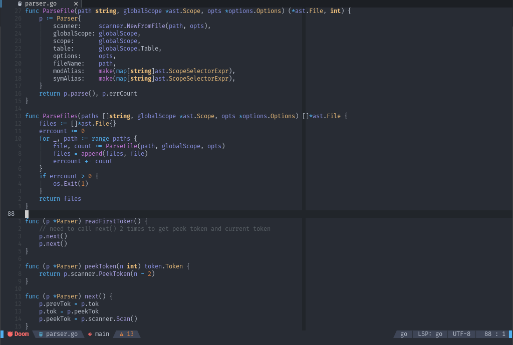

<div align="center">

# doom-one.nvim


[Features](#features) • [Install](#install) • [Contribute](#contribute)



</div>

---

> Come join the dark side, we have cookies.

This colorscheme is ported from [doom-emacs' doom-one].

> **IMPORTANT:** this colorscheme requires Neovim >= 0.5 to work.

## Features

- Optional terminal colors
- Optional TreeSitter support
- Optional transparent background
- Support for numerous plugins (nvim-tree, barbar, lspsaga, etc)

## Install

Packer
```vim
use 'NTBBloodbath/doom-one.nvim'
```

## Options

- `doom_one_enable_treesitter` - Enable TreeSitter support, `v:true` by default.
- `doom_one_terminal_colors` - Enable terminal colors, `v:false` by default.
- `doom_one_transparent_background` - Enable transparent background, `v:false` by default.

> **NOTE:** All those options are global Vim variables and uses `v:true` / `v:false` instead of `1` / `0`.

## Contribute

1. Fork it (https://github.com/NTBBloodbath/doom-one.nvim/fork)
2. Create your feature branch (<kbd>git checkout -b my-new-feature</kbd>)
3. Commit your changes (<kbd>git commit -am 'Add some feature'</kbd>)
4. Push to the branch (<kbd>git push origin my-new-feature</kbd>)
5. Create a new Pull Request

## License

`doom-one.nvim` is [MIT licensed](./LICENSE).

[doom-emacs' doom-one]: https://github.com/hlissner/emacs-doom-themes/blob/master/themes/doom-one-theme.el
