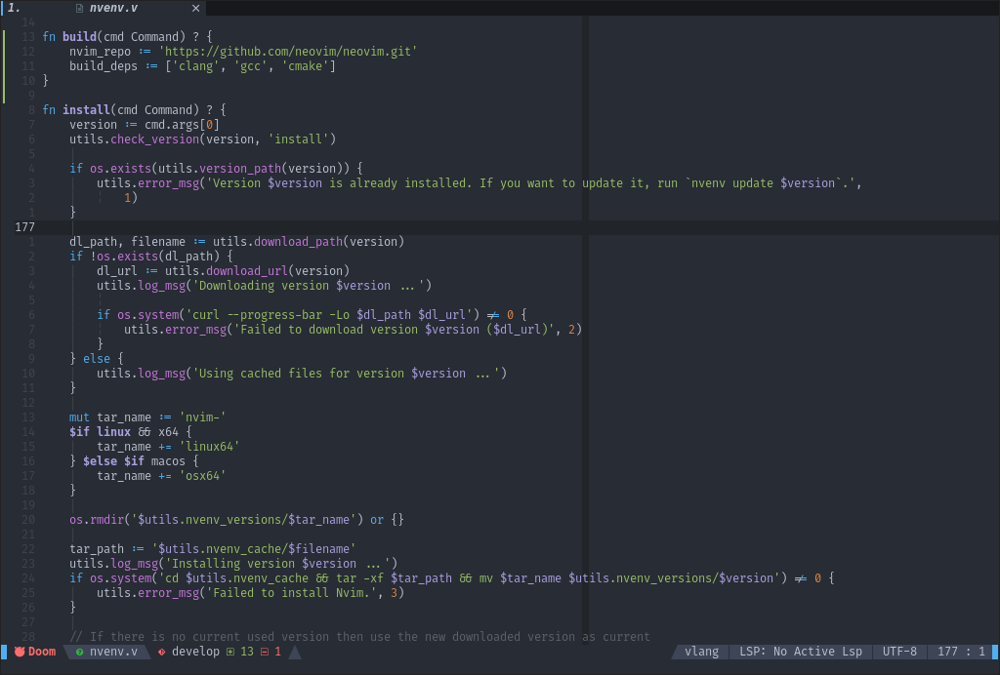
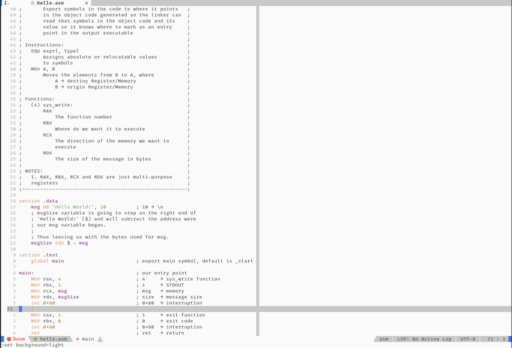

<div align="center">

# doom-one.nvim


[Features](#features) • [Install](#install) • [Screenshots](#screenshots) • [Contribute](#contribute)

</div>

> Come join the dark side, we have cookies.

This colorscheme is ported from [doom-emacs' doom-one].

## Notices

- `2021-10-05`: doom-one configurations are now defined in a `setup` function,
  see [Install](#install) to know the valid setup options.
- `2021-06-16`: since the colorscheme is now 100% lua, your neovim must include
  [this](https://github.com/neovim/neovim/pull/14686).

## Features

- Optional terminal colors
- Optional italic comments
- Optional TreeSitter support
- Optional transparent background
- Optional support for numerous plugins (nvim-tree, barbar, lspsaga, etc)

## Install

Packer
```lua
use({
    'NTBBloodbath/doom-one.nvim',
    setup = function()
        require('doom-one').setup({
            cursor_coloring = false,
            terminal_colors = false,
            italic_comments = false,
            enable_treesitter = true,
            transparent_background = false,
            pumblend = {
                enable = true,
                transparency_amount = 20,
            },
            plugins_integrations = {
                neorg = true,
                barbar = true,
                bufferline = false,
                gitgutter = false,
                gitsigns = true,
                telescope = false,
                neogit = true,
                nvim_tree = true,
                dashboard = true,
                startify = true,
                whichkey = true,
                indent_blankline = true,
                vim_illuminate = true,
                lspsaga = false,
            },
        })
    end,
})
```

> **IMPORTANT:** this colorscheme requires Neovim >= 0.5 to work.

## Screenshots

> Dark variant:



> Light variant:



## Contribute

1. Fork it (https://github.com/NTBBloodbath/doom-one.nvim/fork)
2. Create your feature branch (<kbd>git checkout -b my-new-feature</kbd>)
3. Commit your changes (<kbd>git commit -am 'Add some feature'</kbd>)
4. Push to the branch (<kbd>git push origin my-new-feature</kbd>)
5. Create a new Pull Request

## License

`doom-one.nvim` is [MIT licensed](./LICENSE).

[doom-emacs' doom-one]: https://github.com/hlissner/emacs-doom-themes/blob/master/themes/doom-one-theme.el
